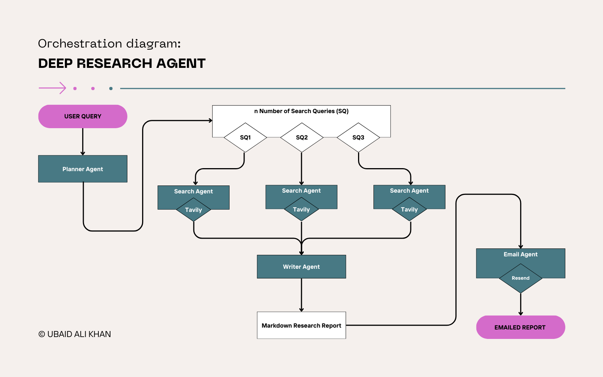

# 🧠Deep Research Engine


A no-cost, multi-agent, agentic AI system designed for autonomous deep research, intelligent information synthesis, and automated report generation.

This project provides a powerful foundation for anyone building AI-powered research assistants, knowledge discovery systems, or autonomous information analysis tools.

## 🚀 Key Features:
- No-Cost.
  - Uses free `gemini-2.5-flash` LLM.
  - Uses `Tavily` free credits as web search tool.
  - Uses `Resend` free credits for sending emails.  
- Multi-Agent Architecture.
- Layered Research Capability.
- Automated Report Generation.
- Modular & Extensible (Can easily add more agents and tools).
- Source-aware Research (Tracks citations).
- Web Support.


## 📁 Project Folder Structure 
```
deep-research-engine/
│
├── assets/
├── src/
│   ├── agents/
│   │   ├── email_agent.py
│   │   ├── planner_agent.py
│   │   ├── search_agent.py
│   │   └── writer_agent.py
│   │
│   ├── models/
│   │   └── gemini.py
│   │
│   ├── orchestrator/
│   │   └── research_manager.py
│   │
│   └── tools/
│       ├── send_email_tool.py
│       └── tavily_web_search_tool.py
│
├── examples/
│   └── sample_reports/
│
├── main.py
├── pyproject.toml
├── .env
├── README.md
└── LICENSE
```


## ⚙️ Setup Instructions
1. Clone the repository
```
> git clone https://github.com/Ubadi-The-Data-Scientist/deep-research-engine.git
> cd deep-research-engine
```
2. Install environment & dependencies (single uv command)
   - create the .venv
   - install all dependencies
   - sync them with your pyproject.toml
```
> uv sync
```
3. Activate the virtual environment
```
> source .venv/bin/activate    # Mac/Linux
> .venv\Scripts\activate       # Windows
```
4. Configure environment variables
```
> cp .env.example .env      # Mac/Linux
> copy .env.example .env    # Windows
```
Then open .env and fill in the required fields.


## ▶️ Usage Example
Basic example
```
# main.py
import asyncio
from src.orchestrator.research_manager import ResearchManager

async def run(query: str):
    async for chunk in ResearchManager().run(query):
        yield chunk

async def main():
    async for chunk in run("What is 3I/Atlas?"):
        # print(chunk)
        pass

if __name__ == "__main__":
    asyncio.run(main())
```
Simple CLI

`python main.py`


## 🤝 Contributing

Contributions, feature ideas, and PRs are welcome!
Please open an issue to discuss major changes before submitting PRs.

## 📜 License

MIT License — free for personal and commercial use.